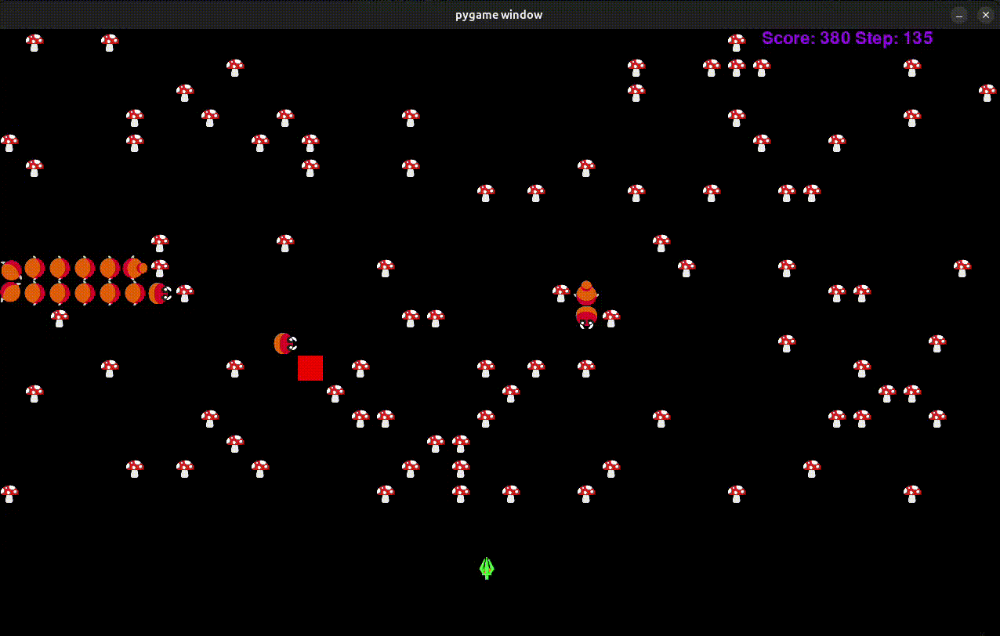

# ia-centipede
Clone of Arcade Centipede for AI classes

## Group:
- [João Cardoso](https://github.com/jcardoso19)
- [Rafael Marques](https://github.com/rafaelfmarquess)

## Grades:
- first delivery - 18.5 (branch: [first-delivery](https://github.com/Paulo-Lacerda1/AI-project/tree/first-delivery))
- final delivery - 15.8



# How to run ?
*HINT:* Create a virtual environment prior to installing the requirements.txt

1st start the server:
```
python3 server.py
```

Optionally start the viewer
```
python3 viewer.py
```

Lastly start the client (can be student.py)
```
python3 client.py
```
